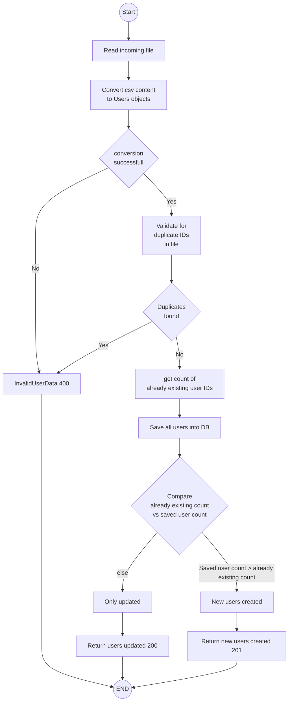
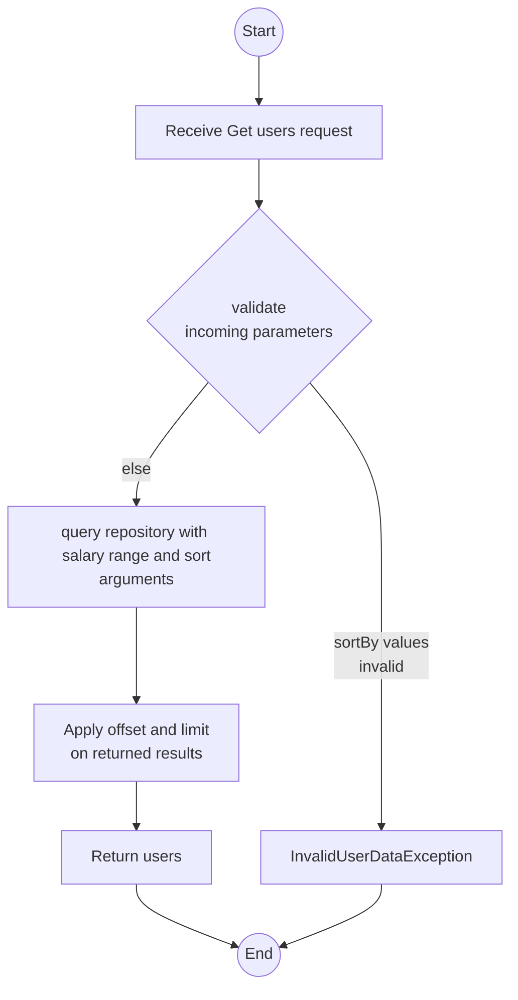

# Demo project for employee salary management
This project consists of a REST api to upload employees and later perform CRUD operations on the data.  
Currently, it uses an in memory DB to persist data. Hence, each shutdown will wipe the data

## Development setup
The project requires below tools for development and build
* Java IDE (Ex. IntelliJ IDEA)
* JDK 11
* Maven 
* git bash

### Other tools for IDE
**Mapstruct and lombok support**

The project uses **mapstruct** for bean mapping and **lombok** for code generation. You may need to install plugins to your IDE to get full compatibility during development 

**Mermaid diagram support in IDE** (Optional)

This readme file contains diagrams with mermaid syntax. Refer below link to find how to enable viewing them in the IDE  
https://www.jetbrains.com/help/idea/markdown.html#diagrams 

## Build guide
To build the code, while in the needed branch you can navigate to the project root and run `mvn clean install`

### Unit test results
Unit test code coverage report can be found at `target/site/jacoco/index.html` after a successful build

## Run application
To run the application using the built artifact, navigate to the `/target`directory after a build and run below command in a terminal  
`java -jar employee-salary-management-0.0.1-SNAPSHOT.jar`  
**NOTE:** You may need to replace the jar file name to reflect the correct artifact name in case of version value changes etc.

#### With docker and mnikube

Need to use a git bash since the minikube docker repository should be pointed before building docker image and in other terminal this does not work
eval $(minikube -p minikube docker-env)
docker build .
alias k=kubectl
k replace --force  -f specs/postgres.yaml
k create configmap hostname-config --from-literal=postgres_host=$(kubectl get svc postgres -o jsonpath="{.spec.clusterIP}")
k replace --force -f specs/salary-mgmt.yaml

k get po
k get logs salary-mgmt
k exec -it salary-mgmt -- tail -f logs/spring.log

### Calling REST endpoints

#### Upload users (POST /v1/users/upload)

You can find a sample file to try at: [test resources](src/test/resources/valid_users_upload_file.csv)

Sample curl command  
`curl -i -X POST 'http://localhost:8080/v1/users/upload' -F "file=@/c/codes/employee-salary-management/src/test/resources/valid_users_upload_file.csv"`

#### Fetch users (GET /v1/users)

Sample curl command  
`curl -i 'http://localhost:8080/v1/users?minSalary=2000&maxSalary=200000&sortBy=salary,asc&sortBy=id,desc'`

### Application design documentation

### General considerations
Since the application seems to have paging and sorting capabilities, PagingAndSortingRepository is used
No attempts to analyze performance against heavy loads have been made so far.  
Hence, situations such as uploading a very large file, database having very large amounts of data can result unintended system slowness

#### Upload users design decisions
* String incoming field character lengths not validated. 
* For salary values, currency is not accounted. 
* If incoming file has at least one ID not existing in the database, 201 is returned upon successful operation
* If all IDs in the incoming file exist in the database, 200 is returned upon successful operation 
* In some operations such as DB write, if an error occurres, the resulting exception message is passed back to client for simplicity at this stage

#### Upload users operation flow

#### Fetch users design decisions
* Since the required limit and offset value support does not allign with the paging concept, only sorting and filtering 
is done at repository and the offset and limit is processed on the application 
* sortBy parameter must follow format sortBy=<fieldName>,<direction>. direction can be `asc` or `desc`

